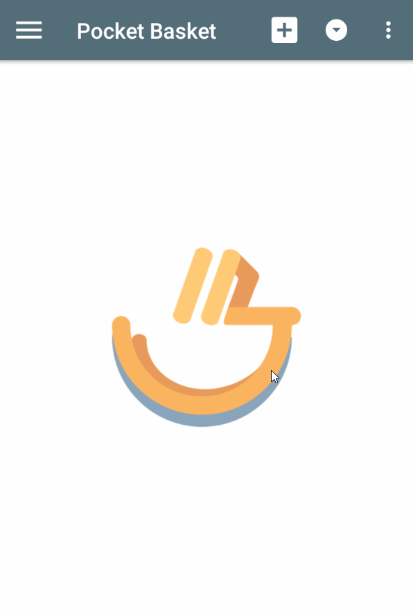

# Pocket Basket

Author: **Minh Nguyen**

My first Android application when I was at university. The quality of code at that time was very basic when I get started with Android in 2015.

私の最初人造人間アプリケーション私が大学にいたとき。2015 年にコードを記述する始めるとき、その時点でコードの品質は非常に基本的だった。プログラミング

  
